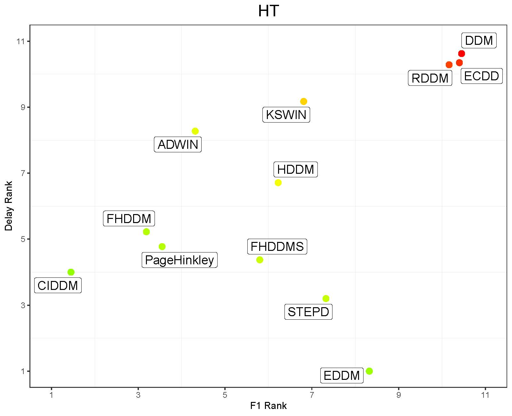

# CIDDM: Class Informed Concept Drift Detection Method

## Abstract
Dynamic environments pose significant challenges to machine learning models due to the presence of concept drift, wherein the underlying data distribution evolves over time. Moreover, concept drift can affect only a subset of classes globally or locally. In response to this challenge, this paper introduces a novel approach, referred to as the Class Informed Drift Detection Method (CIDDM), designed to detect and respond to concept drifts in multi-class data streams. CIDDM leverages statistical descriptors and class-specific information to precisely identify both local and global concept drifts. Through rigorous and extensive experimentation and comparison with $11$ state-of-the-art methods, the proposed drift detector demonstrates superior performance in detecting concept drifts, particularly in scenarios with local changes within the data stream. Moreover, CIDDM's classifier-agnostic nature ensures its adaptability across diverse learning models. Furthermore, we investigate the impact of combining drift detectors and classifiers on predictive performance. The results of this study validate CIDDM's efficacy in detecting concept drift and therefore enhancing the resilience of machine learning systems to concept drift, thereby advancing the field of stream learning and bolstering the reliability of machine learning applications in dynamic environments.

<table>
  <tr>
    <td colspan="2"><h3>Average ranking comparison between drift detectors</h3></td>
  </tr>
  <tr>
    <td valign="top"></td>
    <td valign="top"></td>
  </tr>
 </table>

## Implementation details

CIDDM class is implemented in the file `drift_detectors/multi_class_detector.py`.
The drift detector was implemented in Python 3.8 using river package. 

### How to run

```python
import numpy as np
from river.datasets import synth

stream_1 = synth.Agrawal(
    classification_function=0,
    seed=42
)

stream_2 = synth.Agrawal(
    classification_function=0,
    seed=42
)

ciddm = InformedDrift(n_classes=2)

for x, y in stream_1.take(1000):
    dd.update(x, y)

# Drifting streams

for x, y in stream_2.take(1000):
    dd.update(x, y)
    if (dd.drift.any()):
      print ("Drift detected on instance {} of class {}".format(i, np.where(dd.drift==1)[0][0]))
```

## Reference

```
@misc{aguiar2024ciddm,
  author={Aguiar, Gabriel and Cano, Alberto},
  title={CIDDM: Class Informed Concept Drift Detector Method},
  year={2024},
}
```
